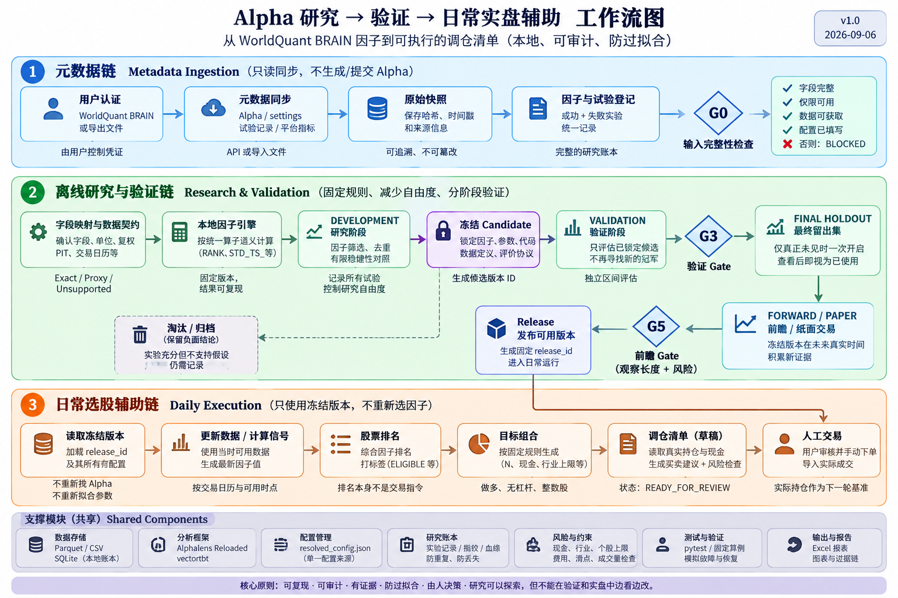

# US Equity Alpha — V4 local factor workflow

> **Current canonical artifact (2026-09-15):**
> `private/project_factor_library/reconstruction-v4/`. It records 886 BRAIN
> sources, reconstructs 317 source associations into 135 unique local formulas,
> and verifies all 135 formulas on saved engineering samples. The other 569
> sources remain explicitly deferred. Every formula remains `DIAGNOSTIC_ONLY`;
> no research or trading release has been activated.

当前设计以 BRAIN 的经济假设为来源，使用已有 Alpaca / Tiingo 能力构造项目自己的直接因子与 Proxy Alpha。主方案见 [原工程设计方案](../2026-09-06-us-equity-alpha-implementation-plan.md)，重点为第 6.3–6.8 节、T2b 和 QA37–48。



## 实际实现状态

- BRAIN 当前同步范围：886 个唯一 Alpha ID，885 个表达式可安全解析；历史全部搜索尝试仍未证实完整。
- 依赖映射：203 项（含 settings 分类依赖）；8 个直接候选、25 个派生/代理候选、109 个专门数据需求、61 个未知。字段分类不等于已经实现 Proxy。
- T2b 已为 886 个来源生成假设卡片和逐项决策；T2c 增加设置级中性化、PIT 分类输入及 Tiingo Fundamentals 当前分类适配器。
- V4 保留 317 个可重建来源与 135 个去重公式；全部 135 个公式已完成工程样本计算验证，569 个来源继续 `DEFERRED`。
- 原 93 个仅缺中性化来源已全部通过 220 会话、8 标的合成工程回放；该结果只证明代码可计算，不能代替真实分类数据或研究验证。
- 真实数据仍缺 65 个 SUBINDUSTRY、26 个 INDUSTRY、1 个 SECTOR 来源所需的分类标签；Tiingo EOD 和 Alpaca 股票行情均不提供这些标签。
- BRAIN 数值等价认证为 0；历史 PIT/真实完整股票池未验证；工程可计算不代表研究或实盘准入。
- 所有 135 个候选均为 `DIAGNOSTIC_ONLY`，没有自动进入冻结 release；转换过程未读取或继承 BRAIN Sharpe、Fitness、收益等绩效标签。

[T2c 中性化报告](../2026-09-08-t2c-neutralization-implementation.md) · [T2b 实施报告](../2026-09-08-t2b-proxy-factor-library.md) · [首批迁移证据](../2026-09-07-batch-alpha-migration.md) · [双数据源验证](../2026-09-07-dual-provider-validation.md) · [T0–T3 实施任务](docs/phase1-implementation.md)

## 转换设计与数据边界

```text
原始 BRAIN 库 + 已验证数据能力
  → 假设卡片 → 直接/Proxy/暂缓决策 → 有限模板 → 工程验证
  → 去重后的项目候选因子库 → 原 T3–T8 工作流
```

原始公式与 settings 永久保留；目标 Proxy 使用新本地定义，明确机制、信息损失、暴露、设置和来源血缘。多个原 ID 可归并为同一本地因子。不为提高数量硬凑代理，不继承平台 Sharpe/Fitness，不自动进入冻结 release。组合、Alphalens/vectorbt、signal/execution 输出及手动交易边界不变。

当前真实样本证明了两源 OHLCV 的局部可计算性；其他衍生能力、VWAP/公司行动处理、历史基本面和分类按能力目录逐项审核。Tiingo Fundamentals、SEC 或其他数据源不是已完成接入的能力。转换器设计不会放宽原 T4–T8 对 PIT、行业约束和执行报价的要求。

当前运行配置已指向 V4 诊断候选库。Tiingo Fundamentals `/meta` 可提供当前 sector/industry，并可用 SIC code 构造显式 subindustry proxy；接口没有历史分类序列，因此当前数据只能支持当日 live proxy，不能用于历史防过拟合验证。该配置不构成研究准入或实盘发布。

## Canonical local artifacts

- `private/project_factor_library/CURRENT_LOCAL_ALPHA_LIBRARY.json`：唯一当前库指针。
- `private/project_factor_library/reconstruction-v4/`：V4 定义、血缘、决策、验证矩阵与 manifest。
- `private/runs/expanded-500-2020-2025-v1/`：当前 50 证券加 SPY 的 2019-10 至 2025-12 工程输入。
- `private/runs/v4-three-alpha-workflow-sample-20260914-v1/`：Alphalens、vectorbt、排名、目标持仓、调仓清单和证据账本样例。
- `scripts/run_v4_three_alpha_workflow_sample.py`：当前完整样例入口。
- `scripts/build_v4_sample_workbooks.mjs`：当前审核工作簿生成器。

旧版本仅保留转换报告、manifest、逐来源决策等审计元数据；其可由保存输入重新生成的 `factor_values/` 已在 2026-09-15 清理。清理范围与保留原因见 [V4 清理清单](docs/implementation/2026-09-15-v4-cleanup-manifest.md)。

## Commands

Create the environment from `dependency-lock.txt`, then install the local wheel
without build isolation so pip uses the already locked build dependency:

```bash
.venv/bin/python -m pip install --no-build-isolation --no-deps .
```

Run the installed CLI directly:

```bash
.venv/bin/us-equity-alpha environment-check \
  --output runs/environment/environment_check.json

.venv/bin/us-equity-alpha login-brain \
  --session-file private/brain_session.json

.venv/bin/us-equity-alpha sync-brain \
  --session-file private/brain_session.json \
  --output private/runs/brain-sync

.venv/bin/us-equity-alpha map-library \
  --registry private/runs/t1-live-import/alpha_registry.json \
  --field-catalog private/local_snapshots/wq_usa_top3000_delay1_data_fields.json \
  --output private/runs/t2-live-mapping

.venv/bin/us-equity-alpha fetch-tiingo-classifications \
  --output private/runs/tiingo-classifications-current

PYTHONPATH=src .venv/bin/python -m pytest -q
```

Credentials, account data, Alpha IDs, formulas, raw pages, and generated
registries remain under ignored `private/` or `runs/` paths.
